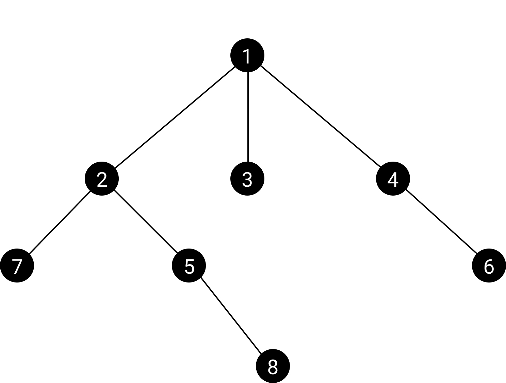
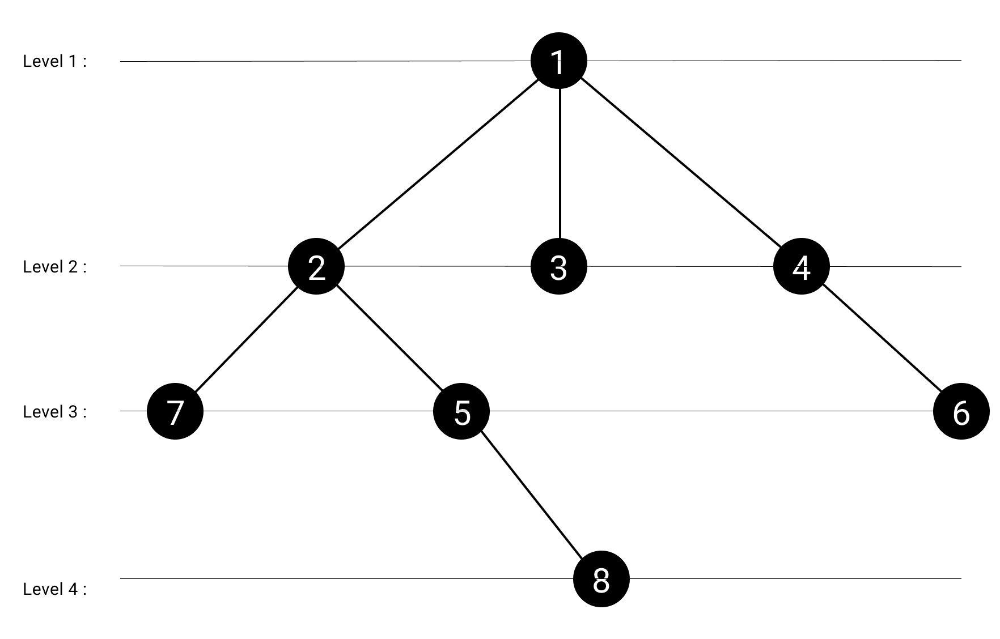
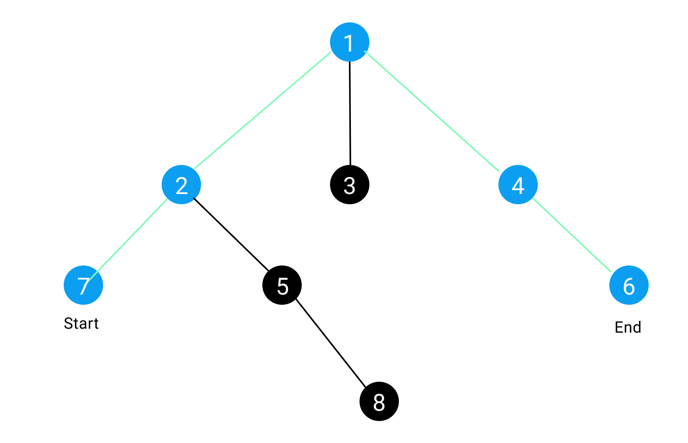
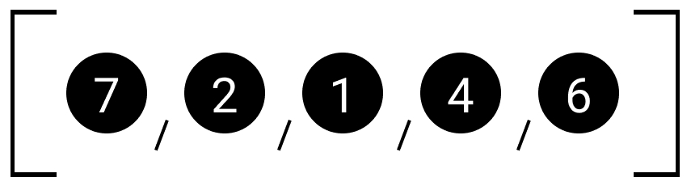
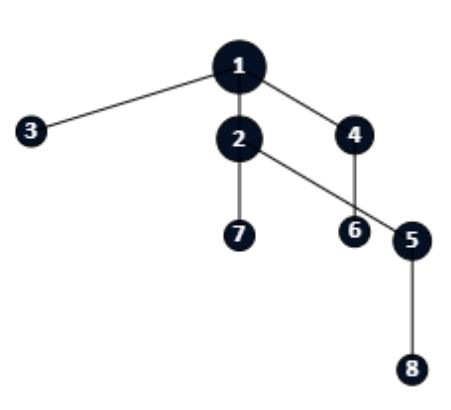

# TreeStructure - Algorithms and Visualization
<meta name="Marius Arhaug" content="Tree Traversal and Visualization">

## How it works:
The program run by [**main.py**](./main.py), gathers data from an [**excel spreadsheet**](./Oppgave.xlsx). The spreadshit includes two rows: ID and ParentID that are integers that represent the ID of an object and the ID of its parent object. 

Whenever we stumble upon a row where it has an empty ParentID we can interpret that as a _root_ of a new tree. Where the rows that has their ParentID refrencing the root's ID are the root's children.  

#### Example 1 - Excel format:
ID        | Parent ID
:----------:|:----------:
1       | 
2       | 1
3       | 1
4       | 1
7       | 2
5       | 2
8       | 5
6       | 4
> Table columns/row dosen't have to be sorted in any particular order. The example table is listed this way to make it easier for us to read. 
In this example row one has an ID of 1 and an empty ParentID therefore it is the root of our tree. 



A visual representation of the tree created from Example 1.


#### Node 
To better maintain and manipulate the data gathered from the spreadsheet it would be advisable to convert them into class objects. A node class has therefore been implementedin the file [**Node.py**](./node.py), where the initial state of the object looks like this: After converting all the rows in the excel sheet into individual Node objects, can we finally start to create our tree.  
```python
Class Node:

  def __init__(self, id: int, parent_id=None):
      self.id = id
      self.parent_id = parent_id
      self.depth = 1
      self.children = []
      self.parent: Optional[Node] = None
```

#### Create tree strucutre: 
To achieve the fastest run time we can utilize a hashmap and take advantage of its constant lookup time. By assign each the ID of the node as a key and the node object itself as a value we can easily reference each parent node to add their respective child node. 
```python
def create_tree(root: Node, node_list: List[Node]) -> Node:
    """
    Creates a tree structure by first hashing all node's ids into hashmap.
    Then find every parent id and add as child. Use hashmaps constant look up time O(1) to our advantage.
    :param root: Root of the tree to be created
    :param node_list: List of nodes that have both a own unique ID and a Parent_ID.
    :return: Root of created tree.
    """
    hashmap = {root.id: root}

    for node in node_list:
        hashmap[node.id] = node

    for node in node_list:
        hashmap[node.parent_id].add_child(hashmap[node.id])

    create_depth([root])
    return root
```

#### Reference from child to parent and from parent to child:
The add_child method in the Node class also creates a two way refrence from child to parent. Due to the nature of the excel sheet every node can only have a single parent. 
```python
def add_child(self, node: Node) -> None:
    """
    Add child to node if this node is parent of incoming node.
    Add parent to incoming child. Parent is "self"
    :param node: child to be added
    :return: None
    """
    if self.is_parent(node):
        self.children.append(node)
        node.add_parent(self)

def is_parent(self, node: Node) -> bool:
    return self.id == node.parent_id

def add_parent(self, node: Node) -> None:
    self.parent = node
```

#### Create and find depth/height of tree:
After creating the final tree structure(s), we can assign a depth value to each node in the tree. The root has a depth level of 1, then each child of the root has a depth of 2 and so on. 
</br>

>Depth levels of tree wherer root node has starting height/depth of 1. 
</br>


This is achieved by traversing the tree, starting from the root and incrementing a counter everytime its done traversing a node's children. It then begins to traverse the child's children and so on until there are no more. This functions mutates the incomming root argument. 


```python
def create_depth(node_list: List[Node], depth=1):
    """
    Go through tree recursively and increment depth counter for each level
    :param node_list: list of root nodes
    :param depth: start depth
    :return: None. Mutate roots in node_list
    """
    for node in node_list:
        node.depth = depth
        create_depth(node.children, depth + 1)
```

To find the maximum depth aka the height of tree we recursivly traverse through the tree's node. If we encounter a depth that is bigger than our current max we change our current max to that level. Finally when there are no more children we return the max. 

```python
def find_maximum(root: Node, max_depth=1) -> int:
    """
    Find deepest depth level of leaf nodes in a given tree
    :param root: Root of tree
    :param max_depth: int value of the deepest level
    :return: max_depth: int
    """
    new_max = max_depth
    for child in root:
        if new_max < child.depth and len(child.children) == 0:
            new_max = child.depth
            continue
        new_max = find_maximum(child.children, new_max)
    return new_max
```

#### Find path from one node to another 
Lets say we want to find the path from a node i.e Node 7 to Node 6. what would be the most efficient way to do this? 

The fastest way to solve this is to let both nodes begin a traversal up to the root of the tree. This is done with two while loops where we change _current_node_ to be the parent of our start and end nodes. By the end of this traversal we will have two paths for each node respecitvely where there may be a common node in both paths. If thats the case we can then concat path one and reverse the second path to get a final path that has the node visited ordered from start to end. There will always be atleast one common node in both paths that being the root. This is our wors case. 


If one of the paths encounter the other node we're looking for i.e end_node is an ancsestor of start_node we can return out of the function earlier.


```python
def find_path(root: Node, start_node: Node, end_node: Node) -> List[Node]:
    """
    Find path from start_node to end_node.
    Find parent path from both start node and end node and then find first common node in both paths
    Remove excess nodes from both paths and concat them to a combined path.
    Reverse path_two such that the final path is in sorted order.
    :param root: Root node of a given tree
    :param start_node: node we want to find path from
    :param end_node: node we want to find path to
    :return: path of nodes or empty path if there is no such path.
    """
    current_node = start_node
    path_one = []
    while current_node != root:
        path_one.append(current_node)
        current_node = current_node.parent
        if current_node == end_node:
            path_one.append(current_node)
            return path_one

    current_node = end_node
    path_two = []
    while current_node != root:
        path_two.append(current_node)
        current_node = current_node.parent
        if current_node == start_node:
            path_two.append(current_node)
            path_two.reverse()
            return path_two

    common_node = None
    for node in path_one:
        if node in path_two:
            common_node = node
            break
    if common_node is None:
        return []

    path_one = path_one[0: path_one.index(common_node)+1]
    path_two = path_two[0: path_two.index(common_node)]
    path_two.reverse()
    final_path = path_one + path_two
    return final_path

```
An visualization of the algorithm: 

>Find path from Node 7 to Node 6.
</br>

>List of nodes visited from Node 7 to Node 6.
</br>

## Visualization
To visualize our tree we can use the json library in Python. To avoid JSON circular refrence we have to implenet our own obj to dict method that the JSON.dumps can convert into JSON objects. 

```python
def to_JSON(self) -> str:
  return json.dumps(self.__to_dict__(), indent=2)
```

The following output will be an json file that we could potentially send as an API etc. Using JavaScript we can visualize this by either creating SVG elements or drawing on a canvas. 

```json
{
  "id": 1,
  "parent_id": null,
  "depth": 1,
  "children": [
    {
      "id": 2,
      "parent_id": 1,
      "depth": 2,
      "children": [
        {
          "id": 7,
          "parent_id": 2,
          "depth": 3,
          "children": []
        },
        {
          "id": 5,
          "parent_id": 2,
          "depth": 3,
          "children": [
            {
              "id": 8,
              "parent_id": 5,
              "depth": 4,
              "children": []
            }
          ]
        }
      ]
    },
    {
      "id": 3,
      "parent_id": 1,
      "depth": 2,
      "children": []
    },
    {
      "id": 4,
      "parent_id": 1,
      "depth": 2,
      "children": [
        {
          "id": 6,
          "parent_id": 4,
          "depth": 3,
          "children": []
        }
      ]
    }
  ]
}

```
> JSON structure of Tree from Example 1
> 

Using JavaScript as mentioned earlier we can visualize it. Using the functions *visualize* *drawTree* and *drawAndUpdateNodeArray*. This can be followed through. 

```javascript
export default function visualize(jsonObj) {
  canvas = document.getElementById('canvas');
  canvas.width = window.innerWidth;
  canvas.height = window.innerHeight;
  ctx = canvas.getContext('2d');

  const root = new Node(jsonObj)
  root.drawNode();
  drawTree(root);
  root.drawID();
}

/**
 * Draw a tree on canvas from a given root Node
 * Split opp root's children in two halfes,
 * so that they can be drawn from center then +/- depending on left and right.
 * @param {*} root Root of the tree
 * @returns undefined. 
 */
function drawTree(root) {
  if (root.children.length === 0) {
    return;
  }
  let children = root.children;
  const half = Math.ceil(children.length / 2);
  let firstHalf = children.splice(0, half);
  let secondHalf = children.splice(-half);
  
  firstHalf = drawAndUpdateNodeArray(root, firstHalf, true);
  secondHalf = drawAndUpdateNodeArray(root, secondHalf, false);
  children = [...[...firstHalf, ...secondHalf]];
  for (let childNode of children) {
    drawTree(childNode);
    childNode.drawID();
  }
}
/**
 * Draw nodes in nodeArray aswell as edge from drawn node to root node. 
 * @param {*} root Root/parent of the nodeArray
 * @param {*} nodeArray array of children nodes of root
 * @param {*} left decide to draw nodes either to the left or right. 
 * @returns Updated array where json objects have been turned into Node objects.
 */
const drawAndUpdateNodeArray = (root, nodeArray, left) => {
  return nodeArray.map((node, i) => {
    node = new Node(node);
    const x = root.x + (left ? -1 : 1 ) * (20 + node.radius*2)*(i + (left ? 0 : 1))*(1.5 * nodeArray.length * 0.5 * node.depth);
    const y = root.y + (50 + node.radius*2) * 0.25 * node.depth;
    node.updateCoordinates(x, y);
    node.drawNode();
    node.drawEdge(root.x , root.y);
    return node;
  })
}

```


> Final output from JS script.
> 
